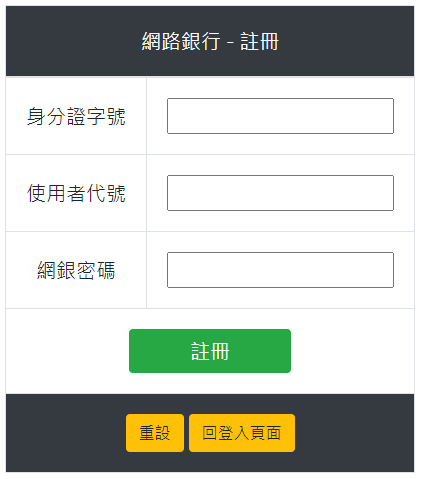
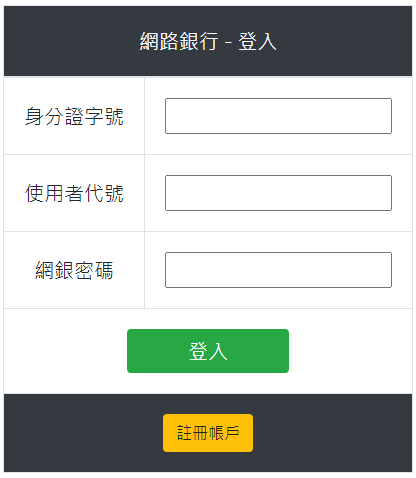
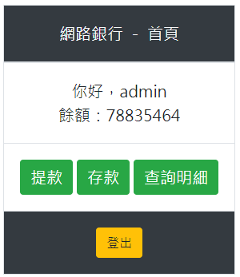
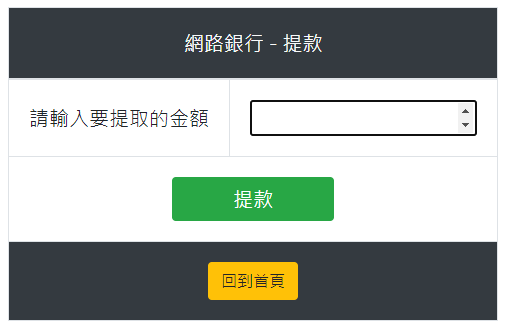
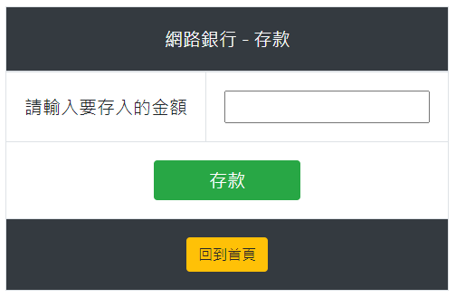
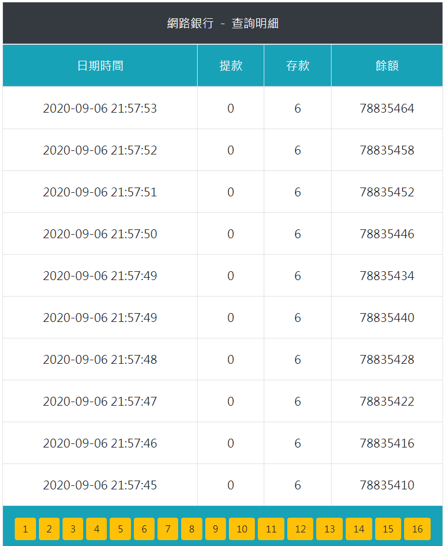

# RD5-Assignment
## 註冊
1. 欄位不得為空
1. 身份證字號不可與其他使用者相同
1. 網銀密碼大於8個字元，需含大小寫與數字 

## 登入
1. 欄位不得為空
1. 所有欄位與完全符合才可登入 

## 首頁
1. 顯示使用者代號與餘額
1. 點擊餘額可隱藏金額 

## 提款
1. 欄位只能為數字，否則會報錯
1. 若提款超出存款會提款失敗並跳出提示 

## 存款
欄位只能為數字，否則會報錯 

## 查詢明細
1. 可查看存款與提款的歷史紀錄
2. 若超過10筆會自動新增頁數 
